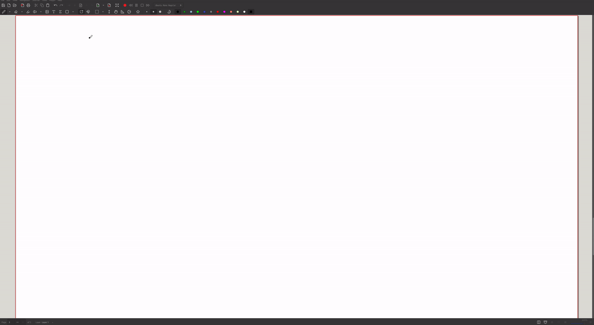

# Wacom Precision Mode

A simple precision mode tool written in Python for
[Wacom tablets](https://www.wacom.com/en-us/products/pen-tablets) on Linux
with [X11](https://en.wikipedia.org/wiki/X_Window_System).

The offset to the target area is given by the current stylus position. The size
of the target area can be specified. An optional graphical overlay is used to
visually indicate the target area. Applications beneath the overlay can still
receive mouse/keyboard/... inputs.

## Demo



The keyboard shortcuts used in the demo:
```bash
# 0.5 scale (green in demo)
/path/to/venv/bin/python /path/to/wacom_precision_mode.py --scale 0.5 --action toggle --gui

# 0.2 scale (red in demo)
/path/to/venv/bin/python /path/to/wacom_precision_mode.py --scale 0.2 --action toggle --gui
```

Note that I've accidentally written `scale 0.3` in the video, while it's been
0.2.

## Installation

This tool requires Python 3. Tested on Linux Mint 22.1 (Cinnamon edition) with
Python 3.12.3 and a Wacom Intuos S tablet.

Required Python packages:
- Non-GUI mode: `python-xlib` (may already be installed)
- GUI mode (`--gui`) additionally requires `PyQt6`

Install all dependencies in a virtual environment:
```bash
python3 -m venv venv
source venv/bin/activate
pip install -r requirements.txt
```

## Usage

You need to specify
- Scale factor (`--scale SCALE`): defines the precision area as a fraction of
  the monitor's full dimensions.
    - Example: `--scale 0.3` sets the active area to 30% of the screen.
    - On multi-monitor setups, scaling is relative to the monitor under the
      stylus.
- Action (`--action toggle|enable|disable`):
    - `toggle`: enables precision mode if disabled, otherwise disables it.
    - `enable`: enables precision mode.
    - `disable`: disables precision mode.
- Optional graphical overlay (--gui): Displays an overlay indicating the active
  tablet area.

If you specify the command as a shortcut (e.g. to later bind to a tablet
button), make sure to use the Python interpreter inside the virtual environment
(`/path/to/venv/bin/python`) to ensure dependencies are accessible.

## Some Details

### Coordinate System

- Points on the screen are represented as $(x, y)$ coordinates.
- The origin $(0,0)$ is at the top-left corner of the primary monitor.
- In multi-monitor setups, the $x$-offset is $0$ for the leftmost monitor and
  positive for others.

Sketch of example layout with two monitors of different size (green area =
target area if precision mode is enabled):


### Coordinate Transformation Matrix (CTM)

You can list all Wacom input devices with
```bash
xinput | grep -i wacom
```

Example output:
```bash
⎜   ↳ Wacom Intuos BT S Pen stylus              id=9    [slave  pointer  (2)]
⎜   ↳ Wacom Intuos BT S Pad pad                 id=10   [slave  pointer  (2)]
```

Then list the properties of the stylus:
```bash
xinput list-props 9
```

Important for us is the `Coordinate Transformation Matrix` (CTM) which
transforms a coordinate $(x,y,z)$ (=stylus input) to a target coordinate
$(x',y',z')$ on the screen. Formally, $(x',y',z')^T = CTM \cdot (x,y,z)^T$.

The default (precision mode disabled) CTM is
```txt
1.000000, 0.000000, 0.000000, 0.000000, 1.000000, 0.000000, 0.000000, 0.000000, 1.000000
```

which is the 3x3 identity matrix
```math
\begin{bmatrix}1 & 0 & 0 \\ 0 & 1 & 0 \\ 0 & 0 & 1\end{bmatrix}
```

denoted in row-major order.

To restrict the stylus movement to a smaller area, we modify the identity-CTM in
four entries:
```math
\begin{bmatrix}x_{scale} & 0 & x_{offset} \\ 0 & y_{scale} & y_{offset} \\ 0 & 0 & 1\end{bmatrix}
```

Where:
- $x,y_{offset}$: set to the $x,y$-position of the stylus to position the stylus
  in the top-left corner of the target area.
- $x,y_{scale}$: with one monitor this is the specified `--scale`. With
  multiple monitors, we first have to compute the percentage that the monitor
  under the stylus takes up in the overall $x,y$-range, and then scale
  that with the specified `--scale`.

We end up with the following CTM:
```math
\begin{bmatrix}
scale \cdot \frac{width_{mon}}{width_{total}} & 0 & \frac{x_{stylus}}{width_{total}} \\
0 & scale \cdot \frac{height_{mon}}{height_{total}} & \frac{y_{stylus}}{height_{total}} \\
0 & 0 & 1
\end{bmatrix}
```

